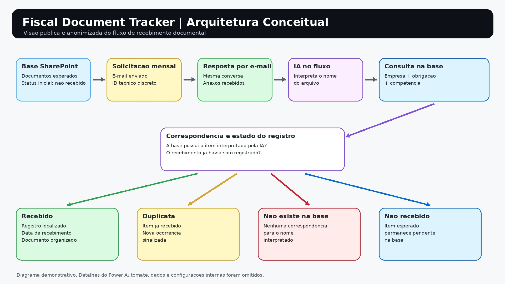

# TaxFlow-Tracker

Fiscal Document Tracker
> Automação de acompanhamento do recebimento de obrigações fiscais por e-mail, com identificação assistida por IA, controle no SharePoint e rastreabilidade do fluxo.


Sobre o projeto
Este repositório documenta, de forma conceitual e anonimizada, uma automação criada para acompanhar o recebimento periódico de documentos relacionados a obrigações fiscais.
A solução envia e-mails de solicitação no início do período. Cada mensagem contém um identificador técnico inserido de maneira discreta no corpo do e-mail, com formatação visual em branco. Quando a empresa prestadora responde à mensagem com os documentos anexados, a automação utiliza esse identificador para reconhecer que a resposta pertence ao fluxo original.
Em seguida, uma etapa de inteligência artificial integrada ao fluxo interpreta o nome do arquivo recebido. O resultado é comparado com uma base de controle no SharePoint, que representa os documentos esperados por empresa, tipo de obrigação e competência.
O objetivo não é validar o conteúdo tributário do documento. A automação atua no controle operacional do recebimento, organização e rastreabilidade.
Aviso de confidencialidade
Este projeto foi reconstruído exclusivamente para portfólio. O repositório não contém:
nomes reais de empresas, prestadores ou usuários;
endereços de e-mail corporativos;
documentos fiscais ou mensagens reais;
URLs, listas, bibliotecas ou caminhos internos do SharePoint;
exportações do Power Automate;
prompts, configurações ou conexões corporativas;
identificadores reais de mensagens ou execuções;
regras fiscais internas.
Todos os nomes, valores, datas e identificadores apresentados são fictícios.
Problema
O processo mensal envolve diversos documentos esperados, distribuídos por empresa, tipo de obrigação e competência. Sem um controle centralizado, torna-se mais difícil responder rapidamente a perguntas como:
Qual documento já foi recebido?
Qual documento continua pendente?
O mesmo documento foi enviado mais de uma vez?
O anexo recebido existe na base de controle?
A resposta pertence à solicitação enviada no início do período?
Solução
A automação combina quatro elementos principais:
E-mail controlado, usado para enviar a solicitação e receber a resposta.
Identificador técnico discreto, usado para correlacionar a resposta com o fluxo original.
IA integrada à automação, usada para interpretar o nome do anexo.
SharePoint, usado como base de acompanhamento dos documentos esperados e recebidos.
Arquitetura conceitual

> Salve a imagem fornecida neste repositório como `docs/architecture.jpg`.
O diagrama é propositalmente conceitual. Detalhes internos do fluxo, conexões, expressões, prompts e configurações não são apresentados.
Fluxo funcional
1. Base de controle
O SharePoint mantém a relação de documentos esperados. Cada registro pode conter campos conceituais como:
empresa;
tipo de obrigação;
competência;
data de vencimento;
status;
data de recebimento.
Exemplo fictício:
Empresa	Tipo de obrigação	Competência	Vencimento	Status	Recebimento
Unidade Alpha	Apuração de tributo A	08/2026	09/2026	Não recebido	
Unidade Beta	Apuração de tributo B	08/2026	09/2026	Recebido	08/09/2026
2. Envio da solicitação
No início do período, a automação envia uma mensagem solicitando o documento esperado. A mensagem orienta que a resposta seja enviada na mesma conversa e que o anexo siga um padrão de nomenclatura.
Exemplo fictício:
```text
unidade-alpha - apuracao-tributo-a 08.2026.pdf
```
3. Identificador técnico discreto
O e-mail contém um identificador técnico usado pela automação para reconhecer a conversa. Esse identificador permanece no corpo da mensagem, mas é formatado em branco para reduzir interferência visual para quem recebe.
Exemplo exclusivamente demonstrativo:
```html
<span style="color: #ffffff; font-size: 1px;">FLOW_ID: DEMO-2026-08-A1B2C3</span>
```
> Em uma implementação real, a ocultação visual não deve ser tratada como mecanismo de segurança. O identificador serve para correlação operacional e não deve conter informações sensíveis.
4. Recebimento da resposta
A empresa prestadora responde ao e-mail original e inclui um ou mais anexos. A permanência do identificador na cadeia permite que a automação relacione a resposta à solicitação previamente enviada.
Mensagens novas, que não preservam a cadeia esperada, podem ficar fora do processamento automático.
5. Identificação do anexo com IA
Uma etapa de IA integrada ao Power Automate analisa o nome do arquivo para identificar os dados necessários à consulta da base, como:
empresa ou unidade;
tipo de obrigação;
competência.
A IA é usada para lidar com pequenas variações de nomenclatura. A decisão final de correspondência depende da existência do registro na base de controle.
Exemplo conceitual:
```text
Entrada: unidade alpha apuracao tributo a ago 2026.pdf

Saída estruturada:
{
  "empresa": "unidade-alpha",
  "tipo": "apuracao-tributo-a",
  "competencia": "08/2026"
}
```
6. Consulta e atualização no SharePoint
Os dados interpretados são utilizados para buscar o registro correspondente. Quando há correspondência, a automação registra o recebimento e organiza o documento no local definido pelo processo.
Caso não haja correspondência, a ocorrência recebe o status adequado para conferência.
Status utilizados
A documentação pública representa somente os quatro estados efetivamente relevantes para o processo:
Status	Significado
Recebido	O anexo corresponde a um registro existente e o recebimento foi registrado
Duplicata	O documento correspondente já havia sido recebido anteriormente
Não existe na base de dados	A IA interpretou o nome, mas não foi localizado um registro correspondente
Não recebido	O documento é esperado, porém ainda não foi localizado em uma resposta válida
O status Não recebido representa a condição inicial ou pendente. Dependendo da configuração visual da lista, esse estado também pode ser exibido como Pendente.
Lógica resumida
```text
para cada resposta recebida:
    localizar o identificador técnico na cadeia do e-mail

    se o identificador não for localizado:
        não processar como parte do fluxo controlado

    para cada anexo:
        usar IA para interpretar o nome do arquivo
        buscar empresa + obrigação + competência no SharePoint

        se o registro não existir:
            definir "Não existe na base de dados"

        senão, se já houver recebimento registrado:
            definir "Duplicata"

        senão:
            armazenar o anexo
            gravar a data de recebimento
            definir "Recebido"

para registros esperados sem documento correspondente:
    manter "Não recebido"
```
Limites da automação
A automação não pretende:
validar cálculos tributários;
confirmar valores, alíquotas ou vencimentos presentes no PDF;
substituir a análise fiscal;
autenticar o remetente apenas pelo identificador técnico;
comprovar a integridade jurídica do documento;
tomar decisões tributárias.
A IA apoia a identificação pelo nome do arquivo, enquanto o SharePoint mantém o controle operacional do recebimento.
Benefícios
visão centralizada dos documentos esperados;
identificação simples de pendências;
detecção de envios duplicados;
destaque para anexos sem correspondência na base;
registro da data de recebimento;
rastreabilidade entre solicitação e resposta;
organização do armazenamento documental;
apoio à conferência e à auditoria operacional.
Tecnologias
Microsoft Power Automate;
Microsoft Outlook;
Microsoft SharePoint;
recurso de IA integrado ao fluxo;
processamento de anexos;
automação orientada a eventos;
classificação e atualização de registros.
Minha contribuição
Minha participação no projeto envolveu atividades como:
entendimento e documentação do processo;
apoio à construção do fluxo de rastreabilidade;
definição da correlação por identificador técnico;
organização da lógica de acompanhamento no SharePoint;
apoio à validação dos anexos pelo nome do arquivo;
definição dos status operacionais;
testes de recebimento, duplicidade, ausência na base e pendência;
documentação da solução para manutenção e portfólio.

Segurança
O identificador invisível é um recurso de correlação e não de autenticação. Uma versão de produção deve depender também dos controles disponíveis no ambiente corporativo, como permissões, conectores autorizados e políticas organizacionais. Esses controles não são detalhados neste repositório.
Aviso final
Este repositório possui finalidade exclusivamente educacional e de portfólio. A implementação pública descreve o comportamento em alto nível e emprega somente dados fictícios. Nenhum conteúdo deste repositório representa documentos, configurações ou informações pertencentes a uma organização específica.
